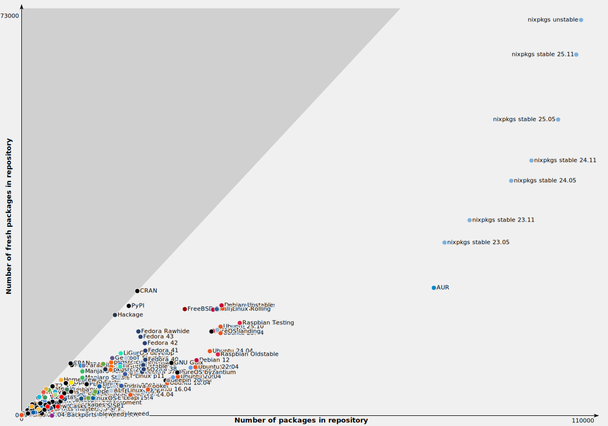

# A Deep Dive into Nix and How to Use it<br><br>
Declarative, Reproducible, Immutable, and Reliable Package Management with Nix

University of Guilan, Rasht, Iran, 2025

---
---
# Table of Contents
<ol>
<v-click>
<li>Introduction to Nix<br>
    1.1 Why should i care about Nix ?<br>
    1.2 Nix Language Crash Course<br>
    1.3 How Nix manages software<br></li></v-click>
<v-click>
<li>How to integrate Nix into your workflow<br>
    2.1 Using Nix<br>
    2.2 Using Nix Shells<br>
    2.3 Using Home Manager<br>
    2.4 Using Nix Flakes<br>
    2.5 Using NixOS<br></li>
</v-click>
</ol>

---
---
<div class="relative h-full flex items-center justify-center">
  <h1 class="text-5xl font-bold text-white drop-shadow-lg" style="font-size: 70px;">1. Introduction to Nix</h1>
</div>
---
---
# Why should i care about Nix ?
Reliable Software Deployment

Nix was made to adress a lot of issues that plagued how software deployment worked back then; and to this day (aside from Nix itself) all software deployment systems include some or all of the following list of issues:
<v-clicks><ul>
<li>Dependency specifications are not validated, leading to incomplete deployment.</li>
<li>Dependency specifications are inexact (e.g., nominal).</li>
<li>It is not possible to deploy multiple versions or variants of a component side-by-side.</li>
<li>Components can interfere with each other.</li>
<li>Upgrade actions are destructive (It is not possible to roll back to previous configurations).</li>
<li>Upgrade actions are not atomic.</li>
<li>Applications must be monolithic, i.e., they must statically contain all their dependencies.</li>
<li>Deployment actions can only be performed by administrators, not by unprivileged users.</li>
<li>And a few more...</li>
</ul></v-clicks>
---
---
{width=75% style="margin: auto;"}
---
---
<div class="relative h-full flex items-center justify-center">
  <h1 class="text-5xl font-bold text-white drop-shadow-lg" style="font-size: 50px;">Nix Language Crash Course</h1>
</div>
---
layout: center
---

<div class="text-center text-6xl font-bold leading-tight">
  <span class="relative inline-block">
    <svg v-click="['+1', '+1']" class="absolute pointer-events-none" style="left: -30px; top: -30px; width: calc(100% + 60px); height: calc(100% + 60px);">
      <ellipse cx="50%" cy="60%" rx="48%" ry="35%" fill="none" stroke="#ba5c3dff" stroke-width="6"
        transform="rotate(-3 50 50)" style="stroke-linecap: round;" pathLength="100"
        stroke-dasharray="100" stroke-dashoffset="0" />
    </svg>
    <span class="relative z-10">Purely Functional</span>
  </span>
  <span class="relative inline-block ml-4">
    <svg v-click="['+0', '+1']" class="absolute pointer-events-none" style="left: -30px; top: -30px; width: calc(100% + 60px); height: calc(100% + 60px);">
      <ellipse cx="50%" cy="58%" rx="48%" ry="35%" fill="none" stroke="#4a70c0ff" stroke-width="6"
        transform="rotate(-2 50 50)" style="stroke-linecap: round;" />
    </svg>
    <span class="relative z-10">Domain-specific</span>
  </span>
  <span class="relative inline-block ml-4">
    <svg v-click="['+0', '+1']" class="absolute pointer-events-none" style="left: -30px; top: -30px; width: calc(100% + 60px); height: calc(100% + 60px);">
      <ellipse cx="50%" cy="45%" rx="48%" ry="36%" fill="none" stroke="#42a165ff" stroke-width="6"
        transform="rotate(3 50 50)" style="stroke-linecap: round;" />
    </svg>
    <span class="relative z-10">Turing Complete</span>
  </span>
  Programming language
</div>

<style>
.slidev-vclick-hidden {
  opacity: 0;
}

.slidev-vclick-fade {
  transition: opacity 0.3s ease;
}
</style>

---
layout: center
class: text-center
---

<div  class="relative h-full flex items-center justify-center">
<h1 class="text-5xl font-bold text-white drop-shadow-lg" style="font-size: 40px;">Data Types in Nix</h1></div>
<div class="grid-container">
  <div v-click class="grid-item top-left">
    <div class="content">
      <strong>Int: <code>4</code><br>Float: <code>4.1</code></strong>
    </div>
  </div>
  
  <div v-click class="grid-item top-center">
    <div class="content">
      <strong>Boolean:<br><code>true / false</code></strong>
    </div>
  </div>
  
  <div v-click class="grid-item top-right">
    <div class="content">
      <strong>String:<br><code>"1line"<br>''multi<br>line''</code></strong>
    </div>
  </div>
  
  <div v-click class="grid-item bottom-left">
    <div class="content">
      <strong>Path:<br><code>./rel/path<br>/absolute/path</code></strong>
    </div>
  </div>
  
  <div v-click class="grid-item bottom-center">
    <div class="content">
      <strong>List:<br><code>[./one "2" 3]</code></strong>
    </div>
  </div>
  
  <div v-click class="grid-item bottom-right">
    <div class="content">
      <strong>Attribute Set:</strong><br/>
      <code>{a = "hello";<br/>
      b = false;}</code>
    </div>
  </div>
</div>
<div v-click><br>
Note: all variables in Nix are immutable</div>

<style>
.grid-container {
  display: grid;
  grid-template-columns: repeat(3, 1fr);
  grid-template-rows: repeat(2, 1fr);
  width: 100%;
  height: 90%;
  margin: 0 auto;
  border: 0px solid #333;
}

.grid-item {
  display: flex;
  align-items: center;
  justify-content: center;
  padding: 2rem;
  font-size: 1.2rem;
  text-align: center;
}

.top-left {
  border-right: 2px solid #333;
  border-bottom: 2px solid #333;
  border-left: 2px solid #333;
  border-top: 2px solid #333;
}

.top-center {
  border-right: 2px solid #333;
  border-bottom: 2px solid #333;
  border-left: 0px solid #333;
  border-top: 2px solid #333;
}

.top-right {
  border-right: 2px solid #333;
  border-bottom: 2px solid #333;
  border-left: 0px solid #333;
  border-top: 2px solid #333;
}

.bottom-left {
  border-right: 2px solid #333;
  border-bottom: 2px solid #333;
  border-left: 2px solid #333;
  border-top: 0px solid #333;
}

.bottom-center {
  border-right: 2px solid #333;
  border-bottom: 2px solid #333;
  border-left: 0px solid #333;
  border-top: 0px solid #333;
}

.bottom-right{
  border-right: 2px solid #333;
  border-bottom: 2px solid #333;
  border-left: 0px solid #333;
  border-top: 0px solid #333;
}

.content {
  line-height: 1.6;
}
</style>

---
layout: center
class: text-center
---

<div  class="relative h-full flex items-center justify-center">
<h1 class="text-5xl font-bold text-white drop-shadow-lg" style="font-size: 40px;">Functions in Nix</h1></div>
<div class="grid-container">
  <div v-click class="grid-item top-left">
    <div class="content">
      <strong>Defining a Function<br><code>f = a : a + 2;<br>f 1 <span style="color: #6a737d; font-style: italic;">//3</span></code></strong>
    </div>
  </div>
<!-- f = a: a+2;f = (a,b): a+b; Xf = {a,b}: a+b;f {a=1; b=2;} == 3f {a=5;} Xf = {a,b ? 50}: a+b -->
  <div v-click class="grid-item top-right">
    <div class="content">
      <strong><s>Multiple Arguments</s><br><s><code>f = (a, b): a + b;</code></s></strong>
    </div>
  </div>
  
  <div v-click class="grid-item bottom-left">
    <div class="content">
      <strong>Attribute Sets as Args<br><code>f = {a, b}: a + b;<br>f {a = 1; b = 2;} <span style="color: #6a737d; font-style: italic;">//3</span></code></strong>
    </div>
  </div>
  
  <div v-click class="grid-item bottom-right">
    <div class="content">
      <strong>Optional Arguments<br><code>f ={a,b?2}: a+b;<br>f {a=1;} <span style="color: #6a737d; font-style: italic;">//3</span></code></strong>
    </div>
  </div>
</div>

<style>
.grid-container {
  display: grid;
  grid-template-columns: repeat(2, 1fr);
  grid-template-rows: repeat(2, 1fr);
  width: 100%;
  height: 90%;
  margin: 0 auto;
  border: 0px solid #333;
}

.grid-item {
  display: flex;
  align-items: center;
  justify-content: center;
  padding: 2rem;
  font-size: 1.2rem;
  text-align: center;
}

.top-left {
  border-right: 2px solid #333;
  border-bottom: 2px solid #333;
  border-left: 2px solid #333;
  border-top: 2px solid #333;
}

.top-center {
  border-right: 2px solid #333;
  border-bottom: 2px solid #333;
  border-left: 0px solid #333;
  border-top: 2px solid #333;
}

.top-right {
  border-right: 2px solid #333;
  border-bottom: 2px solid #333;
  border-left: 0px solid #333;
  border-top: 2px solid #333;
}

.bottom-left {
  border-right: 2px solid #333;
  border-bottom: 2px solid #333;
  border-left: 2px solid #333;
  border-top: 0px solid #333;
}

.bottom-center {
  border-right: 2px solid #333;
  border-bottom: 2px solid #333;
  border-left: 0px solid #333;
  border-top: 0px solid #333;
}

.bottom-right{
  border-right: 2px solid #333;
  border-bottom: 2px solid #333;
  border-left: 0px solid #333;
  border-top: 0px solid #333;
}

.content {
  line-height: 1.6;
}
</style>
---
---
<div class="relative h-full flex items-center justify-center">
  <h1 class="text-5xl font-bold text-white drop-shadow-lg" style="font-size: 50px;">How Nix manages software</h1>
</div>
---
---

# How to install a derivation using Nix
<ol>
<li>
What is a derivation ?
<div v-click>
    <ul><li> A derivation is a collection of components contained in the Nix store under the same directory</li></ul>
</div></li>
<li>
What does it contain ?
<div v-click>
    <ul><li> Binaries, libraries, media, configuration files ...</li></ul>
    </div></li>
<li>
What is the Nix store ?
<div v-click>
    <ul><li>The place where all derivations are kept (commonly located at <code>/nix/store</code>)</li></ul>
</div></li>
<li>
 What do you need to install a derivation ?
    <ul>
    <div v-click><li> A set of Instructions written in Nix language</li></div>
    <div v-click><li> A List of any build and runtime dependancis required</li></div>
    <div v-click><li> A Source for files needed for building and installing the derivation (excluding dependancis)</li></div>
    <div v-click><li> A Shell script (usually written in bash) for unpacking, building and installing the derivation</li></div>
    </ul></li>
</ol><div v-click>
Lets go take a look!</div>
---
---
# Example: GNU Hello
```nix
{ stdenv, fetchurl, pkgs }:

stdenv.mkDerivation {
  pname = "hello";
  version = "2.12.2";
  
src = fetchurl {
    url = "mirror://gnu/hello/hello-2.12.2.tar.gz";
    hash = "sha256-WpqZbcKSzCTc9BHO6H6S9qrluNE72caBm0x6nc4IGKs=";
  };

# nativeBuildInputs = [ pkgs.gcc pkgs.bash ... ];
# buildInputs = [ pkgs.glibc ];

# unpackPhase = "gunzip -c ./hello-${version}.tar.gz | tar -xf -";
# buildPhase = "make";
# installPhase = "make install";

}
```
<div v-click>Now lets go look at the output!</div>
---
---
# Example: GNU Hello
```
/nix
├── store
│   ├── sqw9kyl8zrfnkklb3vp6gji9jw9qfgb5-hello-2.12.2
│   │   └── bin
│   │       └── hello
│   ├── a1b2c3d4-user-environment  (generation 1 - before hello)
│   │   └── bin -> (symlinks to packages)
│   ├── x9y8z7w6-user-environment  (generation 2 - after hello)
│   │   └── bin
│   │       └── hello -> /nix/store/sqw9kyl8zrfnkklb3vp6gji9jw9qfgb5-hello-2.12.2/bin/hello
│   └── ...
│
└── var
    └── nix
        └── profiles
            ├── per-user
            │   └── youruser
            │       ├── profile -> profile-2-link
            │       ├── profile-1-link -> /nix/store/a1b2c3d4-user-environment
            │       └── profile-2-link -> /nix/store/x9y8z7w6-user-environment
            └── default -> per-user/youruser/profile
```
---
---
# Nix store hashes
<p></p>
Similar to <code>sqw9kyl8zrfnkklb3vp6gji9jw9qfgb5-hello-2.12.2</code> all derivation in the Nix store are stored alongside a hash. Each derivation has a unique hash that's calculated using the .nix file which includes:
<ul>
<v-click><li>The derivation's name, version and target platform</li></v-click>
<v-click><li>The derivation's installation script</li></v-click>
<v-click><li>The hashes for all of the derivation's dependencies</li></v-click>
<v-click>As a result hashes can be fully associated with an output after installation. Furthermore the directory is made read only after installation to ensure the contents always remain the same. This allows us to:</v-click>
<v-click><li>Install multiple versions / configurations of a derivation alongside each other</li></v-click>
<v-click><li>Perform atomic and non-destructive upgrades</li></v-click>
<v-click><li>Roll back to previous system states</li></v-click>
<v-click><li>Cache the output of a derivation so that users don't have to compile software locally</li></v-click>
</ul>

---
---
<div class="relative h-full flex items-center justify-center">
  <h1 class="text-5xl font-bold text-white drop-shadow-lg" style="font-size: 70px;">2. How to integrate Nix<br><br> into your workflow</h1>
</div>
---
---
# Using Nix on Mac, Linux, and WSL

##### You can also install Nix on MacOS and Linux (including WSL for Windows) by running:

```bash

sh <(curl --proto '=https' --tlsv1.2 -L https://nixos.org/nix/install) --daemon

```
in the terminal.
<v-click>
By installing Nix you can access:
</v-click><v-clicks><ul>
<li>nix-env for package installation</li>
<li>Nix Shells</li>
<li>Nix Flakes</li>
<li>Home manager</li>
</ul></v-clicks>
<v-click>

```bash
# Package management
nix-env --install nixpkgs.hello
nix-env --upgrade nixpkgs.hello
nix-env --uninstall nixpkgs.hello
# Rollback to previous generation
nix-env --rollback
# Delete old generations
nix-env --delete-generations 30d
```
</v-click>
---
---
# Using Nix Shells
Reproducible Developer Environments

Nix Shells are Nix's way of handling developer environments. They offer all the benefits of Nix in places where they are needed the most:
<v-clicks><ul>
<li>Declarativeness for ease of sharing and setup</li>
<li>Reproducibility for consistency across the team</li>
<li>Seamless conflict management across otherwise incompatible software</li>
<li>By far the largest software repository in the world at 120 000+ packages</li>
</ul></v-clicks><v-click>
Here is what a simple <code>shell.nix</code> looks like:
```nix
{ pkgs ? import <nixpkgs> {} }:
pkgs.mkShell {
  buildInputs = [
    pkgs.hello
  ];
}
```
</v-click>
---
---
<p></p>
Running <code>nix-shell</code> in a directory with a <code>shell.nix</code> file will launch a dev shell for you with the provided configurations. 
And Nix shells are capable of more than just providing packages! So lets have a look at a more complete shell:

```nix
{ pkgs ? import <nixpkgs> {} }:
pkgs.mkShell {
  
  buildInputs = [
    vscode
    (pkgs.python312.withPackages (
            python-pkgs: [
              python-pkgs.numpy
              python-pkgs.pygame
              python-pkgs.fastapi
              python-pkgs.pytest]))
  ];

  LD_LIBRARY_PATH = "${pkgs.stdenv.cc.cc.lib}/lib";

  shellHook = ''
    fastapi run ~/webapp/api/v1/main.py
    '';
}
```
---
---
# Using Home manager
<p></p>
Home manager allows you to declarativly manage your user enviroment using nix syntax. To install Home manager on a device with Nix installed execute:
```bash
nix-channel --add https://github.com/nix-community/home-manager/archive/master.tar.gz home-manager
nix-channel --update
nix-shell '<home-manager>' -A install
```
After installation a <code>home.nix</code> file will be created at <code>~/.config/home-manager/</code>. Which enables you to:
<ul>
<v-click><li>Manage user packages</li></v-click>
<v-click><li>Configure applications with Nix syntax and manage dotfiles</li></v-click>
<v-click><li>Set environment variables</li></v-click>
</ul><v-click>
Also since it uses Nix, complete rollbacks and atomic upgrades are included as well.
</v-click>
<br><br><v-click>
Lets have a look at a <code>home.nix</code> file!
</v-click>

---
---
```nix
{ config, pkgs, ... }:
{ home.packages = with pkgs; [ vim btop ];

  programs.git = {
    enable = true;
    userName = "Your Name";
    userEmail = "your.email@example.com";
  };

  home.file = {
  ".config/ghostty/config".text = ''
  background-opacity = 0.7
  theme = Gruvbox Dark
  '';
  }

  # Environment variables
  home.sessionVariables = { EDITOR = "vim"; };

  # Home Manager needs a bit of information about you and the paths it should manage
  home.username = "your-username";
  home.homeDirectory = "/home/your-username";
  # Let Home Manager install and manage itself
  programs.home-manager.enable = true;
  # This value determines the Home Manager release that your configuration is compatible with
  home.stateVersion = "25.11"; }
```
---
---
# Using Nix Flakes
Deterministic Inputs

A new feature of Nix Flakes help keep Nix shells, home manager and NixOS configurations pure by making them rely only on the specified input sources rather that inherit them from the system. While not an initial goal of Nix itself; Nix shells and home manager have both heavily leaned towards declarativeness. Flakes also help further that goal by declaring sources and inputs.
They also make build even more reproducible by pinning the inputs to a specific version rather than the latest available. The first time a flake is invoked a <code>flake.lock</code> file is created which pins inputs to exact revisions allowing for complete reproducibility.<br>
```
./
├── flake.lock
├── flake.nix
└── ...
```
Flakes can be used alongside:

 - Nix shells
 - Home manager configurations
 - NixOS configurations (upcoming)
<v-click>
Lets go have a look!
</v-click>

---
---
```nix
{
  description = "Flake description";

  inputs = {
    nixpkgs.url = "github:nixos/nixpkgs/nixos-unstable";
    home-manager.url = "github:nix-community/home-manager";
  };

  outputs = { nixpkgs, home-manager, ... }:
    let
      system = "x86_64-linux";
      pkgs = nixpkgs.legacyPackages.${system};
    in {
      homeConfigurations."youruser" = home-manager.lib.homeManagerConfiguration {
        # home manager configuration
      };
      devShells.default = pkgs.mkShell {
        # devshell configuration
      };
      packages.x86_64-linux.default = nixpkgs.legacyPackages.x86_64-linux.hello;
    };
}
```

##### Enable flakes by adding the following to your nix configuration file :
```nix
nix.settings.experimental-features = ["nix-command" "flakes"];
```

---
---
# Using NixOS
<p></p>
NixOS takes Nix to the next level by providing a Linux distribution (ISO image accessible at <a href="https://nixos.org">nixos.org</a>) that is managed by Nix in its entirety - even including the kernel - with a single configuration file.
<br><v-click>
Lets have a look at a simple <code>configuration.nix</code>:
```nix

{ config, pkgs, ... }:
{  imports = [./hardware-configuration.nix];
  boot.loader.systemd-boot.enable = true;
  boot.kernelPackages = pkgs.linuxPackages_latest;
  networking.hostName = "nixos";
  networking.networkmanager.enable = true;
  time.timeZone = "Asia/Tehran";
  i18n.defaultLocale = "en_US.UTF-8";
  services.displayManager.sddm.enable = true;
  services.desktopManager.plasma6.enable = true
  services.pipewire.enable = true;
  environment.systemPackages = [pkgs.nano];
  users.users.myuser = {
    extraGroups = [ "networkmanager" "wheel" ];
    packages = [pkgs.firefox];
  };
}
```

</v-click>
---
---
# Sources and Resources
Not all resources listed were directly used in the making of this presentation; But all of them are great resources I've found useful throughout my journey with Nix and NixOS.
 - [The Purely Functional Software
Deployment Model](https://edolstra.github.io/pubs/phd-thesis.pdf) by [Eelco Dolstra](https://github.com/edolstra)
 - Many helpful videos by [Vimjoyer](https://www.youtube.com/@vimjoyer)
 - [Nix explained from the ground up](https://www.youtube.com/watch?v=5D3nUU1OVx8&t=45s) by [Surma](https://www.youtube.com/@dassurma)
 - [NixOS Official Website](https://nixos.org/)
 - [NixOS Manual](https://nixos.org/manual/nixos/stable/)
 - [Nix Package and Option Search](https://search.nixos.org/packages)
 - [Nix Pills](https://nixos.org/guides/nix-pills/)
 - [NixOS Wiki](https://nixos.wiki/wiki/Main_Page)
 - [NixOS Forums](https://discourse.nixos.org/)
 - [Nix Package Repository](https://github.com/NixOS/nixpkgs)
 - and many more ...